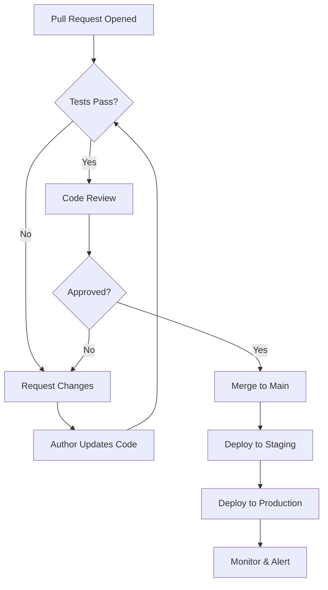
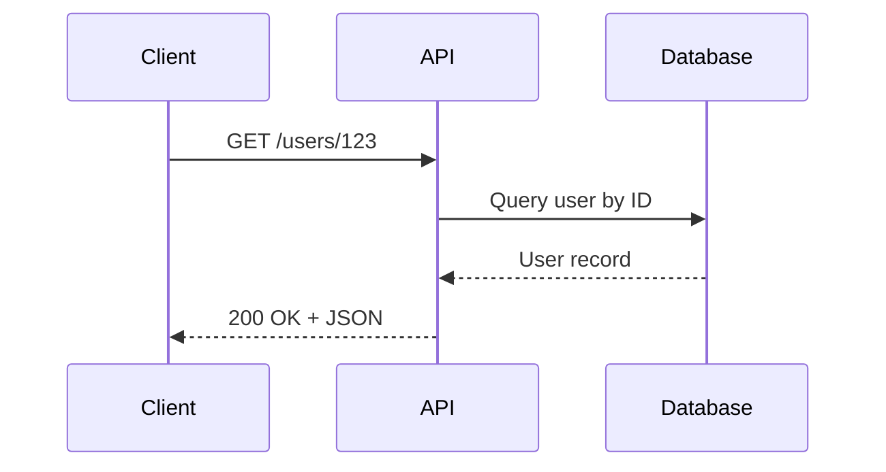
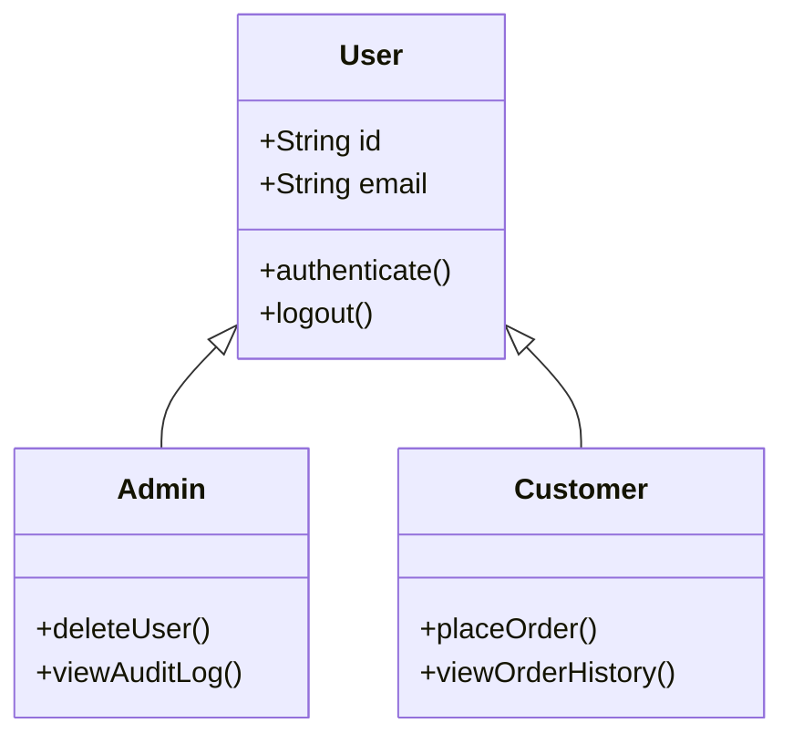
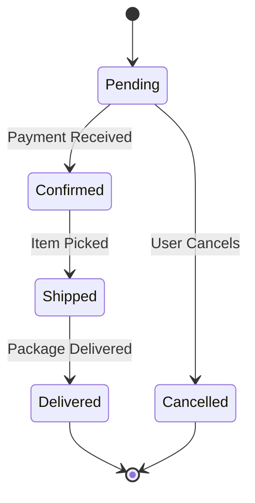
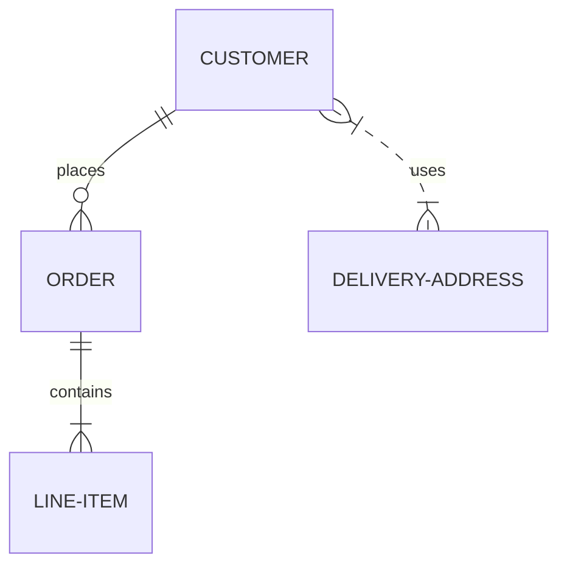

# Examples Analysis: merm8-splash

## Current State

The "Example" button cycles through 5 examples in `/lib/constants.ts`:

1. **Flowchart** - Generic decision tree ("Do something" / "Do something else")
2. **Sequence Diagram** - Textbook Alice/Bob/John conversation loop
3. **Class Diagram** - Animal/Duck inheritance (classic programming example)
4. **ER Diagram** - Customer/Order/Line-Item ecommerce scenario
5. **State Diagram** - Abstract Still/Moving/Crash states

---

## Analysis & Findings

### ✅ What's Working

- **ER Diagram**: Concrete business context (ecommerce) is relatable
- **Coverage**: All major Mermaid diagram types are represented
- **Access**: Easy cycling via the Example button

### ❌ Issues Identified

| Issue | Examples Affected | Impact |
|-------|-------------------|--------|
| **Generic placeholder text** | Flowchart, Sequence | Doesn't inspire or show real use cases |
| **Textbook examples** | Sequence, Class, State | Feel educational but disconnected from practical work |
| **Missing context** | Most examples | Users don't see *why* they'd use these diagram types |
| **No variety in domains** | Mostly tech/academic | Excludes users from other fields (product, ops, design) |
| **Limited demonstration of linter value** | All examples | Don't showcase what issues a linter would catch or fix |

---

## Improvement Opportunities

### 1. **Enhance Sequence Diagram**
**Current**: Alice/Bob/John health check loop  
**Problem**: Textbook example, not relatable  
**Suggestion**: Use a real-world integration or workflow example
- **Option A**: API workflow (client sends request → server validates → returns response)
- **Option B**: Payment processing flow (user → checkout → payment gateway → confirmation)
- **Better copy**: Use actual actors/systems people recognize

### 2. **Replace Generic Flowchart**
**Current**: "Do something" / "Do something else"  
**Problem**: Completely generic and unmotivating  
**Suggestion**: Show a realistic process
- **Option A**: Software release process (code → test → review → deploy)
- **Option B**: Onboarding flow (sign up → verify email → create profile → start using)
- **Option C**: Incident response (detect → alert → investigate → resolve → postmortem)

### 3. **Simplify/Rename Class Diagram**
**Current**: Animal/Duck (academic, verbose)  
**Problem**: Doesn't show modern use cases; inheritance is only one aspect  
**Suggestion**: 
- **Option A**: Simple but practical (e.g., `User`, `Customer`, `Admin` with relationships)
- **Option B**: Backend service architecture (`APIController`, `Service`, `Repository`)
- Consider: Is the linter catching common OOP mistakes? Use that as inspiration.

### 4. **Expand State Diagram**
**Current**: Still/Moving/Crash (abstract, no context)  
**Problem**: Hard to understand when/why to use state diagrams  
**Suggestion**: Practical state machine
- **Option A**: Order lifecycle (Pending → Confirmed → Shipped → Delivered → Returned)
- **Option B**: Media player states (Stopped → Playing → Paused → Stopped)
- **Option C**: User session (Unauthenticated → Authenticating → Authenticated → LoggedOut)

### 5. **Add a Domain-Specific Example (Optional 6th)**
**Suggestion**: Consider adding an example that isn't tech-heavy
- **Option A**: Project management flow (Backlog → Planning → InProgress → Review → Done)
- **Option B**: Content approval workflow (Draft → Review → Approved → Published)
- **Benefit**: Signals that diagram linting isn't just for engineers

---

## Recommended Priority

### High Impact, Low Effort
1. **Replace flowchart** with "Release Process" or "Incident Response"
2. **Replace sequence diagram** with "API Request/Response" or "Payment Flow"

### Medium Impact, Low Effort
3. **Simplify class diagram** to a business-context example (e.g., User/Customer/Admin)
4. **Contextualize state diagram** with domain example (e.g., Order Lifecycle)

### Lower Priority (Nice-to-have)
5. Add 6th example for non-technical workflows (if tool expands beyond engineering teams)

---

## Proposed New Examples

### Example 1: Flowchart - Release Process

### Example 2: Sequence Diagram - API Request Flow

### Example 3: Class Diagram - Role-Based System

### Example 4: State Diagram - Order Lifecycle

### Example 5: ER Diagram (Keep - Already Good)

---

## Key Principles for Selection

✓ **Show practical, real-world scenarios**  
✓ **Use recognizable context** (APIs, payments, workflows)  
✓ **Demonstrate linter value** (good structure, clear relationships)  
✓ **Vary narrative** (technical and operational examples)  
✓ **Keep it accessible** (not niche or overly academic)  

---

## Next Steps

1. **Choose** which examples to update based on feedback
2. **Implement** new example code in `/lib/constants.ts`
3. **Test** that all examples render correctly in the preview
4. **Optional**: Add hover tooltips or labels showing diagram type and use case
